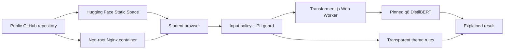

# ESCP Open AI Production Blueprint

[Live Hugging Face Space](https://huggingface.co/spaces/bdboychev/escp-open-ai-production-blueprint) · [Public GitHub repository](https://github.com/KristopherBorja/escp-open-ai-production-blueprint)

A small, public teaching artifact showing how an open model becomes a reviewable production system. The Responsible Feedback Analyser runs a pinned, quantised DistilBERT sentiment model in the student's browser. It also makes privacy, model provenance, containerisation, deployment, governance, cost, and readiness visible.

> Independent educational prototype. Not an official ESCP system or a decision system. Use synthetic feedback only.

## Five-minute student tour

1. Open the **Try demo** area and choose a synthetic example.
2. Watch the browser download the pinned model, then run inference locally in a Web Worker.
3. Inspect sentiment, confidence, deterministic theme evidence, latency, model revision, licence, and limitations.
4. Try the **PII stop** sample: analysis stops before inference and offers local redaction.
5. Open **Architecture**, **Governance**, **Costs**, and **Readiness**. Notice that the public demo gate and institutional-use gate are deliberately separate.

The first visit downloads roughly 68 MB of quantised model weights plus the browser runtime. Model assets are cached by the browser. Feedback is not sent to an application server, but the browser contacts Hugging Face for model files and exposes ordinary network metadata such as IP address.

## Architecture at a glance



The Space and container serve static assets only. There is no application backend, database, analytics service, or server-side inference. See the full [architecture](docs/architecture.md) and [security design](docs/security.md).

## Run locally

Requires Node.js 24.18.x and npm.

```bash
npm ci
npm run dev
```

Run the complete local evidence gate:

```bash
npm run verify
npm run test:coverage
npm run test:browser
```

Run the production container:

```bash
docker build -t escp-open-ai-production-blueprint:local .
docker run --rm -p 8080:8080 escp-open-ai-production-blueprint:local
```

Then open <http://localhost:8080>. The health endpoint is <http://localhost:8080/healthz>.

## Open model contract

| Field            | Value                                                        |
| ---------------- | ------------------------------------------------------------ |
| Browser model    | `Xenova/distilbert-base-uncased-finetuned-sst-2-english`     |
| Upstream model   | `distilbert/distilbert-base-uncased-finetuned-sst-2-english` |
| Revision         | `0b6928efcb76139cae2c6881d49cda67fe119f42`                   |
| Task             | Binary English sentiment classification                      |
| Upstream licence | Apache-2.0                                                   |
| Default runtime  | Transformers.js, Web Worker, WASM/CPU, q8                    |

The immutable revision, expected files, sizes, and hashes are recorded in [`model-manifest.json`](model-manifest.json) and checked against the Hugging Face Hub by `npm run verify:model`.

Important limitations:

- The model was trained on SST-2 movie reviews, not ESCP or educational feedback.
- Binary sentiment loses mixed and neutral nuance.
- Confidence is not calibrated certainty.
- The upstream model card documents bias risks, including sensitivity to identity and country terms.
- Results are demonstrations and must not be used to evaluate people.

## Production evidence

- [Architecture and rollback](docs/architecture.md)
- [Security and privacy](docs/security.md)
- [Governance and model changes](docs/governance.md)
- [Dated cost estimates](docs/costs.md)
- [Production-readiness checklist](docs/readiness.md)
- [Private vulnerability reporting](SECURITY.md)

## Delivery routes

- **Selected:** public Hugging Face Static Space, with in-browser inference and a $0/month platform baseline.
- **Portable:** a reproducible multi-stage Docker image serving the same reviewed build as an unprivileged user.
- **Not selected:** server inference. The cost comparison remains documented so students can see which operational responsibilities the browser-first design avoids.

## Contributing

Changes should be small, reviewed pull requests with green verification. Model or dependency changes must update provenance, evaluation evidence, limitations, cost assumptions, and the relevant documentation together.

## Licence

Code and documentation are licensed under [Apache-2.0](LICENSE). Model files are downloaded from Hugging Face and remain subject to their upstream licences and terms.
