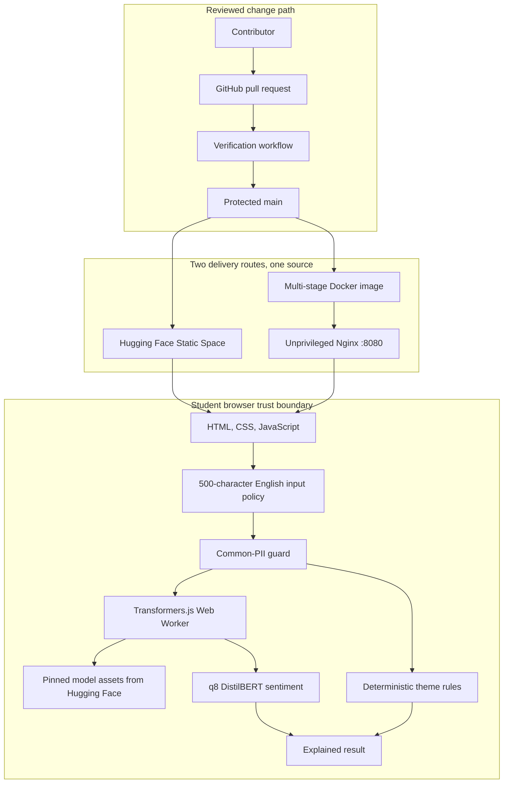

# Deployment architecture

## Purpose

This blueprint teaches the path from an open model to a reproducible public application. It deliberately chooses static delivery and in-browser inference so students can inspect every boundary without operating a model server.

## Runtime and delivery

## Boundaries and data flow

1. GitHub is the source of truth. Reviewed commits, tests, model provenance, container configuration, and release history are public.
2. The Static Space or Nginx container serves immutable application assets. Neither route receives feedback text.
3. The browser applies length and language policy, then detects common email and phone patterns.
4. Detected PII stops the flow before the worker. Redaction happens locally.
5. On first use, the worker requests model files at the exact revision in `model-manifest.json`.
6. Sentiment and deterministic theme evidence are combined into a typed, explained result.
7. Input, output, and request identifiers are not persisted, logged, placed in URLs, or sent to analytics.

The privacy boundary is local inference, not zero network activity: the browser still contacts the application host and Hugging Face, exposing normal transport metadata such as IP address.

## Failure and recovery

| Condition                                   | Behaviour                                                                             |
| ------------------------------------------- | ------------------------------------------------------------------------------------- |
| Model download stalls                       | A bounded inactivity timeout shows a plain-language failure and offers Retry.         |
| Worker crashes                              | Pending work is rejected, the worker is terminated, and a fresh worker is created.    |
| Replacement worker cannot start             | Failure remains visible; Retry attempts fresh construction immediately.               |
| Browser lacks module Workers or WebAssembly | An accessible unsupported-browser state explains minimum capabilities and links here. |
| PII is detected                             | Inference stops; the user can redact locally.                                         |
| Theme rules find no match                   | The result is `Other` with no invented evidence.                                      |

## Container route

The Dockerfile separates build and runtime stages. Node and development dependencies do not enter the runtime image. Static files are owned and served by user `101` on port `8080`. Nginx supplies the Content Security Policy and related response headers. `/healthz` tests delivery only; it does not claim that a student's browser or the external model host is healthy.

## Deployment and rollback

The deployment workflow listens for a successful `Verify` run caused by a push to `main`, checks out that run's exact commit, and syncs only that SHA to one public Static Space. GitHub OIDC is exchanged for a one-hour, Space-scoped Hugging Face credential; no long-lived deployment secret is stored. A repository-owned script performs the Git push without putting the temporary credential in the remote URL. A rollback is:

1. identify the last known-good tagged commit;
2. revert the faulty change through a reviewed pull request;
3. wait for the complete verification workflow;
4. merge the revert and let the guarded Space sync publish it;
5. verify the public Space, model revision, headers, privacy trace, and both readiness gates;
6. record the incident and follow-up action in the release notes.

Do not force-push `main` or silently move the model revision.
