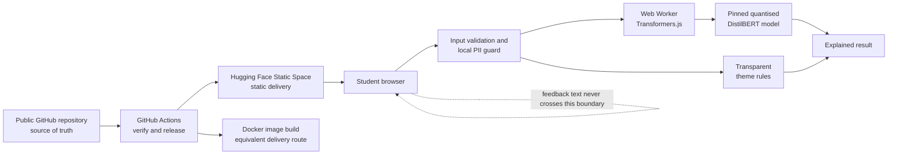

# ESCP Open AI Production Blueprint

## Design status

Approved interactively on 23 July 2026. This document specifies the public teaching artifact before implementation.

## 1. Purpose

Build one small, public, reproducible artifact that shows ESCP students how an open model becomes an application that can be tested, containerised, deployed, governed, costed, and evaluated for production readiness.

The artifact consists of:

1. A public GitHub repository that is the source of truth.
2. A public Hugging Face Static Space containing the working application.
3. A multi-stage Docker image that serves the same built application locally or on a container platform.
4. Documentation and visible in-app content covering architecture, security, governance, costs, and readiness.

The application is a **Responsible Feedback Analyser** for short, synthetic, English-language course feedback.

### Primary audience

ESCP students learning how open AI reaches production. The explanations should assume basic digital literacy but not prior machine-learning operations experience.

### Teaching thesis

Production AI does not have to begin with a large hosted model. A useful production blueprint can be open, private by design, containerised, and nearly zero-cost.

## 2. Success criteria

The artifact succeeds when a student can:

1. Open the Space without creating an account.
2. Analyse a supplied synthetic feedback example.
3. See sentiment, confidence, a transparent theme label, a PII warning state, local inference latency, and model provenance.
4. Understand that feedback text never leaves the browser.
5. Inspect the deployment architecture, governance boundary, cost assumptions, and readiness status from the same application.
6. Clone the repository, run the app locally, build the container, and reproduce the checks from documented commands.
7. See a clear distinction between “ready as a public teaching demo” and “approved for real institutional use.”

## 3. Non-goals

The first release will not include:

- Accounts, authentication, uploads, databases, analytics, or stored history.
- A backend model API.
- Model training, fine-tuning, retrieval-augmented generation, or prompt engineering.
- Generative summaries or recommendations.
- Multilingual input.
- Automated grading, student profiling, disciplinary use, staff evaluation, or workflow routing.
- Claims that the selected sentiment model is validated for educational feedback.
- Kubernetes, Terraform, a cloud account, or paid monitoring.
- Official ESCP logos or a claim that the artifact is an official ESCP product without separate permission.

## 4. Selected approach

### Decision

Use a Hugging Face Static Space with in-browser inference.

The Space serves static HTML, CSS, and JavaScript. A Web Worker loads a quantised open model through Transformers.js and performs inference on the student’s device. Common PII patterns and feedback themes are handled by transparent deterministic functions.

The same static build is packaged in a multi-stage Docker image. Node builds the assets; an unprivileged Nginx runtime serves them.

### Why this approach

- Static Spaces are available without paid compute.
- No application server receives the feedback text.
- There is no per-inference platform bill.
- Students can inspect each boundary without infrastructure noise.
- The container remains meaningful: it is an equivalent delivery route for the same immutable build.

### Rejected alternatives

#### Docker Space with a small instruction model

This is a conventional server-inference pattern, but it introduces cold starts, output validation, more operational complexity, and a paid Hugging Face account requirement for creating compute Spaces. It also weakens the selected zero-cost and privacy-by-design story.

#### Thin frontend with hosted inference

This is easy to operate but introduces credentials, usage costs, an external inference dependency, and a smaller inspectable surface.

## 5. Student experience

### Page structure

The Space is a single responsive application with five primary sections:

1. **Try the demo**
2. **Architecture**
3. **Governance**
4. **Costs**
5. **Readiness checklist**

The top of the page presents three persistent facts:

- Open model
- Browser-only inference
- Zero-dollar baseline hosting

### Demo interaction

The demo contains:

- A selection of synthetic examples.
- A text area for English feedback, limited to 500 characters.
- A privacy notice stating that the text stays on the device.
- A visible model-loading state and progress.
- An Analyse button disabled until the model is ready and the input is valid.
- Results showing sentiment, confidence, theme, PII status, inference backend, latency, model identifier, and model revision.
- A plain-language limitation stating that the output is assistive and must not drive decisions.
- A “What just happened?” explanation of guard, protect, infer, and explain.

### Visual and accessibility requirements

- Calm, academic visual identity without using protected ESCP branding assets.
- Responsive layout at 360 px and above.
- WCAG 2.2 AA colour contrast for text and controls.
- Full keyboard operation, visible focus, semantic headings and labels.
- Loading, warning, and result changes announced through accessible live regions.
- Reduced-motion preference respected.
- Light and dark colour schemes remain legible.

## 6. Architecture



### Runtime data flow

1. The browser downloads the application from the Static Space.
2. The model worker fetches pinned model assets from the Hugging Face Hub on first use and relies on the browser cache afterwards.
3. The app validates the input length and characters locally.
4. The PII guard detects common email and phone patterns locally.
5. If PII is detected, analysis stops by default and the app offers local redaction.
6. The worker runs sentiment inference locally while a deterministic classifier assigns one of a small documented set of themes.
7. The UI combines both outputs into a typed result with provenance, latency, and limitations.
8. No feedback text, result, identifier, telemetry event, or history is sent to an application service.

The privacy notice must also state that the browser contacts Hugging Face to download application/model assets and therefore exposes normal network metadata such as IP address to the hosting platform. “Local inference” must not be presented as “no network activity.”

## 7. Components and contracts

### `input-policy`

**Responsibility:** Validate empty input, maximum length, and supported language expectations.

**Input:** Raw string.

**Output:** A discriminated result containing valid text or user-facing validation errors.

### `pii-guard`

**Responsibility:** Detect and locally redact common email addresses and phone-number patterns.

**Input:** Validated string.

**Output:** Detected spans, categories, redacted text, and an explicit statement that pattern detection is incomplete.

The PII guard is an educational safety layer, not a guarantee that text is anonymous.

### `theme-rules`

**Responsibility:** Assign a transparent theme using versioned keyword rules.

Initial themes:

- Teaching delivery
- Assessment clarity
- Course content
- Technology or platform
- Support or administration
- Other

**Input:** Locally redacted or PII-free text.

**Output:** Theme identifier plus the matching terms used as evidence.

### `model-worker`

**Responsibility:** Load the sentiment model outside the UI thread, report progress, execute inference, and return typed success or error messages.

**Input:** PII-free text and an inference request identifier generated in memory.

**Output:** Sentiment label, confidence, backend, latency, model identifier, and immutable revision.

The request identifier exists only to correlate worker responses and is never persisted.

### `analysis-orchestrator`

**Responsibility:** Enforce the order input policy → PII guard → local analysis → explained result. Local analysis combines the model worker and deterministic theme rules; neither receives unhandled PII.

It must never fabricate or preserve a stale result after an error.

### `blueprint-content`

**Responsibility:** Render the approved architecture, governance ledger, cost model, and readiness checklist inside the Space. Full reference documents remain in `docs/`.

## 8. Open model contract

### Selected model

- Browser conversion: `Xenova/distilbert-base-uncased-finetuned-sst-2-english`
- Upstream model: `distilbert/distilbert-base-uncased-finetuned-sst-2-english`
- Task: Binary English sentiment classification
- Parameters: 67 million
- Upstream licence: Apache-2.0
- Training task: SST-2 movie-review sentiment
- Runtime: Transformers.js in a Web Worker
- Default backend: quantised WASM/CPU
- Optional enhancement: WebGPU when supported, with a tested WASM fallback

The implementation must pin:

- The Transformers.js package version in the lockfile.
- The model repository to an immutable commit revision.
- The expected model files and hashes in `model-manifest.json`.

The implementation must not silently switch models or revisions.

### Required limitations

The UI and documentation must state:

- The model was not trained or validated on ESCP or educational feedback.
- Binary sentiment loses mixed and neutral nuance.
- Confidence is not calibrated certainty.
- The upstream model card documents bias risks, including sensitivity to identity and country terms.
- Results are demonstrations and must not be used to evaluate people.

## 9. Failure handling

| Condition | Required behaviour |
| --- | --- |
| Model is loading | Show determinate progress where available; keep Analyse disabled. |
| Model download fails | Explain the network problem, preserve input locally, and offer Retry. |
| WebGPU is missing or fails | Fall back to quantised WASM/CPU without losing features. |
| Input is empty or too long | Explain the correction next to the field; do not start inference. |
| Common PII is detected | Stop by default; highlight categories and offer local redaction. |
| Worker throws or times out | Terminate/recreate the worker, show a plain-language error, and emit no result. |
| Theme rules find no match | Return Other with no invented evidence. |
| Browser is unsupported | Explain minimum capabilities and link to the architecture documentation. |

Errors are visible in the UI and may be logged to the local developer console without including the feedback text.

## 10. Security design

### Threats considered

- Accidental entry of personal data.
- Excessively long or adversarial text causing resource exhaustion.
- Malicious or compromised JavaScript dependencies.
- Model supply-chain substitution.
- Cross-site scripting through reflected input.
- Leakage through analytics, logs, URLs, or persistent browser storage.
- Container privilege and default-server misconfiguration.
- Misleading confidence or automated overreach.

### Required controls

- Render user text as text, never unsanitised HTML.
- Enforce the 500-character cap before worker execution.
- Keep feedback out of URLs, logs, local storage, session storage, and telemetry.
- Ship no analytics or advertising code.
- Apply a restrictive Content Security Policy with only the tested asset endpoints required for the app and pinned model.
- Pin direct dependencies and commit the lockfile.
- Record the model revision and file hashes.
- Run dependency review and vulnerability scans in CI.
- Build the runtime image from a pinned base image.
- Run the container as a non-root user on an unprivileged port.
- Add secure response headers to the container configuration.
- Publish `SECURITY.md` with a private vulnerability-reporting route when the public repository is created.
- Document rollback to a known-good Git commit and Space revision.

## 11. Governance design

### Intended use

Teaching model inference, privacy-by-design, deployment, cost estimation, and human oversight using synthetic feedback.

### Prohibited use

Grading, profiling, disciplinary action, staff evaluation, admissions, automated routing, or any consequential decision about a person.

### Data policy

- Use supplied synthetic examples.
- Do not request real feedback.
- Do not persist input or output.
- Do not include telemetry.
- Block common PII by default and offer local redaction.

### Accountability

- Repository maintainers own model and dependency changes.
- Changes require reviewed pull requests and green checks.
- The governance and cost documents are reviewed quarterly and whenever the model, hosting platform, or material dependency changes.
- Model changes require updated evaluation evidence and a documented decision.
- The changelog records user-visible, model, security, and governance changes.

## 12. Cost model

Costs are denominated in USD and must be date-stamped in the app and documentation.

### Baseline selected design

| Item | Monthly platform estimate | Assumption |
| --- | ---: | --- |
| Hugging Face Static Space | $0 | Static Space; no compute runtime |
| Public GitHub repository | $0 | GitHub Free |
| Standard GitHub-hosted CI for public repository | $0 | Standard runners; no larger runners |
| Server inference | $0 | Inference runs on the student’s device |
| Local Docker run | $0 incremental | Existing machine; electricity excluded |
| **Baseline total** | **$0/month** | Excludes labour and optional services |

### Teaching comparisons

Using 730 running hours per month and prices checked on 23 July 2026:

| Alternative | Monthly platform estimate | Assumption |
| --- | ---: | --- |
| Hugging Face CPU Upgrade | Approximately $30.90 | $9 PRO + 730 × $0.03/hour |
| Hugging Face T4-small | Approximately $301 | $9 PRO + 730 × $0.40/hour |

Developer time, institutional support, legal review, accessibility review, a custom domain, and optional monitoring must be listed separately rather than represented as free.

### Cost sources

- Hugging Face pricing: <https://huggingface.co/pricing>
- Hugging Face Spaces hardware: <https://huggingface.co/docs/hub/spaces-gpus>
- GitHub Actions billing: <https://docs.github.com/en/billing/concepts/product-billing/github-actions>

## 13. Repository structure

```text
escp-open-ai-production-blueprint/
├── .github/
│   └── workflows/
│       ├── verify.yml
│       └── deploy-space.yml
├── docs/
│   ├── architecture.md
│   ├── costs.md
│   ├── governance.md
│   ├── readiness.md
│   ├── security.md
│   └── superpowers/specs/
├── evals/
│   └── feedback-cases.json
├── src/
│   ├── analysis/
│   │   ├── analysis-orchestrator.ts
│   │   ├── input-policy.ts
│   │   ├── model-worker.ts
│   │   ├── pii-guard.ts
│   │   └── theme-rules.ts
│   ├── content/
│   ├── ui/
│   ├── main.ts
│   └── styles.css
├── tests/
├── Dockerfile
├── LICENSE
├── README.md
├── SECURITY.md
├── index.html
├── model-manifest.json
├── nginx.conf
├── package-lock.json
├── package.json
├── tsconfig.json
└── vite.config.ts
```

Implementation should remain framework-light: TypeScript, Vite, Transformers.js, Vitest, and Playwright. A UI framework is not required.

## 14. Testing and evaluation

### Unit tests

- Input validation boundaries.
- Email and phone-pattern detection/redaction.
- Theme rule matching and evidence.
- Orchestration order.
- Worker message schema.
- Stale-result and error clearing.
- Cost arithmetic.

### Versioned evaluation set

`evals/feedback-cases.json` contains synthetic cases covering:

- Positive, negative, mixed, and negated wording.
- Each supported theme.
- Emails and varied phone patterns.
- Long and empty input.
- Identity and country term probes motivated by the upstream model card.
- Known model limitations that should remain visible rather than be converted into false pass conditions.

The evaluation report distinguishes:

- Deterministic control correctness.
- Model observation.
- Model suitability for the educational domain.

The release gate requires deterministic controls to pass. It must not claim the model is suitable for real educational decisions.

### Browser tests

- Model loading state and progress.
- Synthetic sample analysis.
- PII stop and local-redaction path.
- WASM fallback path.
- Clear failure and retry behaviour.
- No network request containing feedback text.
- Keyboard navigation and accessible names.
- Light and dark theme legibility.
- Responsive layout at mobile and desktop sizes.

### Build and container checks

- Typecheck, lint, unit tests, and evaluation checks.
- Production static build.
- Docker image build.
- Container health probe.
- Non-root process assertion.
- Vulnerability and dependency review.
- Basic accessibility and performance budgets.

## 15. Delivery and operations

### Source of truth

The public GitHub repository is authoritative.

### Continuous integration

Pull requests run:

1. Dependency installation from the lockfile.
2. Typecheck and lint.
3. Unit tests and deterministic evaluation gates.
4. Browser smoke and accessibility checks.
5. Static production build.
6. Container build, health, non-root, and vulnerability checks.

### Space deployment

After main is protected and verified, the official `huggingface/hub-sync` GitHub Action mirrors the repository to a public Static Space using:

- `space_sdk: static`
- A fine-grained Hugging Face token scoped only to the target Space, stored as `HF_TOKEN`, or a documented migration to Hugging Face Trusted Publishers when configured.
- `app_build_command: npm run build`
- `app_file: dist/index.html`

The workflow must never expose the token to pull requests from forks.

### Rollback

Rollback means reverting the GitHub repository to the last known-good commit and re-running the sync. The README and readiness checklist identify the known-good release tag.

## 16. Readiness gates

### Gate A: public teaching demo

All items must be green before public launch:

- Intended use and prohibited uses are visible.
- Model identifier, licence, revision, limitations, and source are recorded.
- Synthetic examples are the default.
- No input or result persistence exists.
- PII warning and local redaction work.
- Unit, deterministic eval, browser, accessibility, build, and container checks pass.
- Container runs non-root and has secure headers.
- Dependency and container scans have no unresolved critical findings.
- Cost assumptions are dated and sourced.
- Security reporting, rollback, and maintainer ownership are documented.
- The live Space and Docker build match the verified source revision.

### Gate B: real institutional use

This gate is deliberately **blocked**. It requires work outside this artifact:

- Representative educational-domain validation.
- Bias and disparate-impact assessment.
- Legal, privacy, accessibility, procurement, and institutional approvals.
- Approved policy and lawful basis for real personal data.
- Funded operational owner, support expectations, monitoring, and incident response.
- Validated model choice or domain-specific replacement.

The public UI must show this blocked state.

## 17. External access required to publish

Local implementation and verification can proceed without credentials. Public publication requires:

1. A GitHub account or organisation and permission to create the public repository.
2. A Hugging Face account and permission to create the public Static Space.
3. A chosen GitHub repository owner/name and Hugging Face Space owner/name.
4. A fine-grained Hugging Face token scoped to the target Space, added directly as the `HF_TOKEN` GitHub secret, unless Trusted Publishers is configured.
5. Confirmation that the textual ESCP name may be used and whether an “independent educational prototype” disclaimer is required.

No credential may be placed in the repository or sent through application code.

## 18. Default naming and licensing

- Repository name: `escp-open-ai-production-blueprint`
- Space name: `escp-open-ai-production-blueprint`
- Application name: `Responsible Feedback Analyser`
- Code and documentation licence: Apache-2.0
- Default disclaimer: “Independent educational prototype. Not an official decision system.”

## 19. Acceptance checklist

Implementation is complete only when:

- The approved student experience is implemented.
- The open model runs in the browser from a pinned revision.
- Feedback text is absent from outbound requests and persistent storage.
- All documented quality gates pass locally.
- The container is reproducible and verified non-root.
- The architecture, governance, cost, security, and readiness content is accessible in the Space and repository.
- A public GitHub repository URL and public Hugging Face Space URL are available, or publication is explicitly handed off because the required account access was not provided.
- The final handoff names the verified commit and release tag.

## 20. Reference sources

- Hugging Face Static HTML Spaces: <https://huggingface.co/docs/hub/spaces-sdks-static>
- Hugging Face Spaces overview: <https://huggingface.co/docs/hub/spaces-overview>
- Hugging Face GitHub sync: <https://huggingface.co/docs/hub/spaces-github-actions>
- Hugging Face pricing: <https://huggingface.co/pricing>
- Hugging Face Spaces hardware: <https://huggingface.co/docs/hub/spaces-gpus>
- Transformers.js: <https://huggingface.co/docs/transformers.js/index>
- Transformers.js WebGPU guide: <https://huggingface.co/docs/transformers.js/guides/webgpu>
- Browser model conversion: <https://huggingface.co/Xenova/distilbert-base-uncased-finetuned-sst-2-english>
- Upstream model card: <https://huggingface.co/distilbert/distilbert-base-uncased-finetuned-sst-2-english>
- GitHub Actions billing: <https://docs.github.com/en/billing/concepts/product-billing/github-actions>
